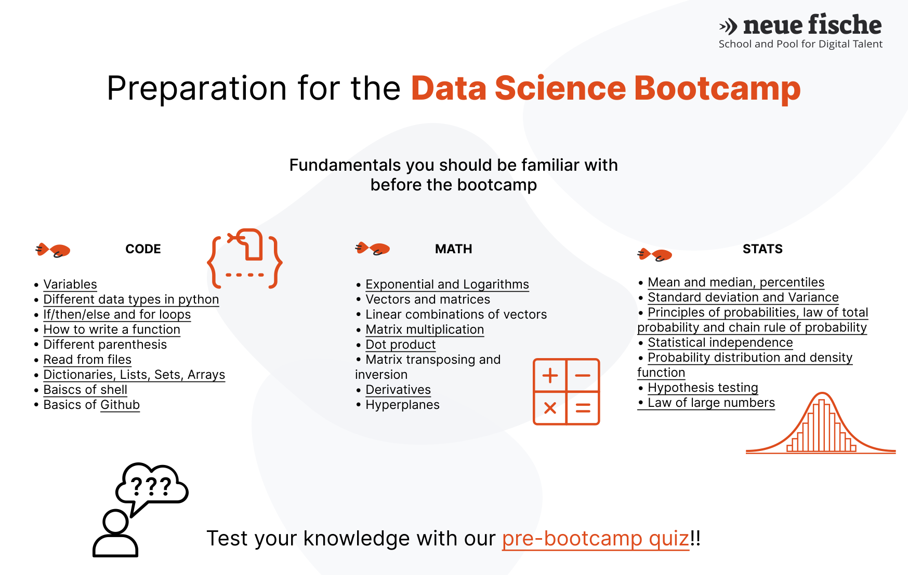

# ds-welcome-package
In order to have a common starting point it is important that you know both some basic statistics and some fundamentals about python programming. In this repository we will cover the general concepts that you should be familiar with before the start of the bootcamp. You do not need to install anything on your computer in order to work with the material, all material is browser based and we will be using [Google Colaboratory](https://colab.research.google.com/).

**Test your knowledge with out [pre-bootcamp quiz](https://docs.google.com/forms/d/e/1FAIpQLSfQmtqIOHvh7h8lat-KfMtEnj6qnudy8LJyJmvhw3TGtfJpBg/viewform)!

### Before you start

If you are not familiar with Google Colab, please start with [Intro to Colab notebook](Intro_to_Colab.ipynb) which shows you how to work with Colab.

The preparation for the data science bootcamp consists of three aspects: python programming, math and statistics (also with python). In case you are not familiar with the following concepts please following the code-alongs and reading/watch material.

## The fundamentals of python programming & coding you should know:
- [Variables and types](programming/1_Python_Variables_Types.ipynb)
- [If/then/else and for loops](programming/2_Python_If_Else_Loops.ipynb)
- [Dictionaries, Lists, Arrays](programming/3_Python_Lists_Sets_Dictionaries.ipynb)
- [How to write a function, function arguments and so on](programming/4_Python_Functions.ipynb)
- [Object-oriented programming](programming/5_Intro_to_OOP.ipynb)
- [Read/write to and from files](programming/6_Read_Write_Files.ipynb)
- [Basics of shell](https://swcarpentry.github.io/shell-novice/01-intro.html)
- [Basics of github](https://github.com/neuefische/ds-github-starter-course)
  
Do not forget, programming is a skill that gets better with practice, if this is your first time with python, you might need repetition. And we will practice this!

## The math concepts you should know:

- [Exponential and Logarithms](https://www.youtube.com/watch?v=oqHJ5xQYTEI)

- Vectors and matrices

- Linear combinations of vectors

- [Matrix multiplication](https://builtin.com/data-science/dot-product-matrix)

- [Matrix transposing](https://www.khanacademy.org/math/linear-algebra/matrix-transformations/matrix-transpose/v/linear-algebra-transpose-of-a-matrix) and [Matrix inversion](https://www.khanacademy.org/math/algebra-home/alg-matrices/alg-intro-to-matrix-inverses/v/inverse-matrix-part-1)

- [Derivatives](https://www.khanacademy.org/math/ap-calculus-ab/ab-differentiation-1-new/ab-2-1/v/derivative-as-a-concept)

- Hyperplanes

## The basic statistics you should know:
- [Random variables, Mean and medians, Variance and Standard deviation](statistics/1-Random-Variables-Mean-Median-Variance.ipynb)
- [Probability, Bayes’ Theorem, Probability distribution](statistics/2-Probability.ipynb)
- [Hypothesis testing](statistics/3-Hypothesis-Testing.ipynb) 
- [Law of large numbers](statistics/4-Law-of-Large-Numbers.ipynb)

Thank you for going through the material! 
Hope you had fun. 
If you have any feedback or improvement suggestions please raise an issue on GitHub.
